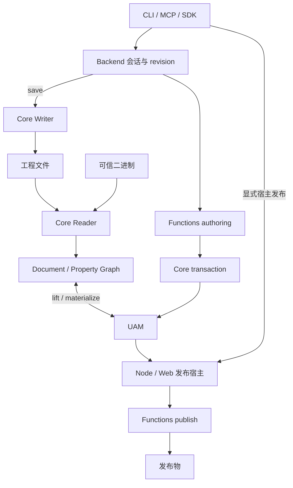

# OpenFairyGUI 架构总览

UAM 是公开的声明式创作契约；Document / Property Graph 是 Core 的内部物化与协议适配模型。导入工程时，原文件及读取诊断决定完整性；查询、预演、保存和发布是不同能力。

| 包 | 拥有的职责 |
|---|---|
| Core | 正式属性、UAM、selector、事务语义、XML/二进制读写及平台 I/O |
| Functions | 无状态事务结果、验证、图集、发布和受限恢复工作流 |
| Backend | 会话、锁、revision、存储协调及读取/创作/运行时服务；根入口 browser-safe |
| CLI | 参数、退出码、JSON envelope；复用 Functions/Backend |
| MCP | Backend 传输映射、预算、文档和 prompts；可选发布回调由宿主显式注入 |
| test-utils | 测试辅助与固定提交的公开 fixture |

Node 能力从 /node 入口提供。Backend 入口在同一模块格式内共享运行时；ESM/CJS 是独立图，不承诺跨格式类身份。安装包分发构建入口、声明与离线文档；CLI 不内联私有依赖副本。

## 数据流

事务在私有工作副本上执行，失败不提交；预演执行后丢弃，不预留 revision。Backend 对会话操作排他调度，apply/save 各自核对 revision。只读完整模型不包含主资源字节，字节通过独立 revision 绑定接口读取。

工程读取、UAM 检查和宿主源数据解码分层；invalid 是确定错误，incomplete 是能力或数据不足。保存仅处理工程拥有的文件，使用暂存、身份复核和回滚，保留不相关根目录内容；清理失败报告备份位置。路径授权、真实文件身份和锁归 Backend/宿主，MCP 注解不是授权。

发布由 Functions 的 Node/Web 宿主执行。MCP 默认不开启发布；显式注入的 publish 回调拥有路径授权、输出范围与插件策略，不改变 Backend 方法集合。CLI tx 每次打开新会话，在同一锁内预演、提交、验证、保存并关闭；跨进程预演不保留会话 revision。

## 契约与文档事实源

Core/Backend/CLI 的 TypeScript 类型生成 operation/schema/CLI envelope；Backend/docs 分发安装版本语料。MCP 按需编译并缓存 schema，输入预算先于深层结构解析；正式二进制输出采用 base64，完整 payload 只放 structuredContent。扩展 JSON 不改写成字节。Host policy 在输入校验后、Backend 调用前执行。

精确字段、限制和恢复流程见[契约](./guide/contracts.md)、[工程验证](./project-validation.md)、[诊断](./guide/diagnostics.md)、[安装文档](./guide/installed-docs.md)、[发布设置](./editor-publish-settings.md)、[二进制协议](./fairygui-binary-package-format.md)和[插件](./publish-plugins.md)。修改入口见[任务指引](./guide/task-recipes.md)，验证见[开发指南](./guide/development.md)，未实现能力见[路线图](./guide/roadmap.md)。
