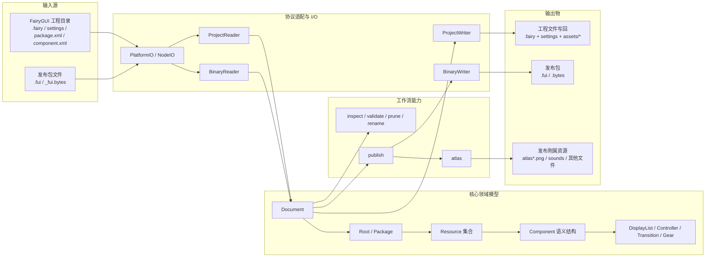
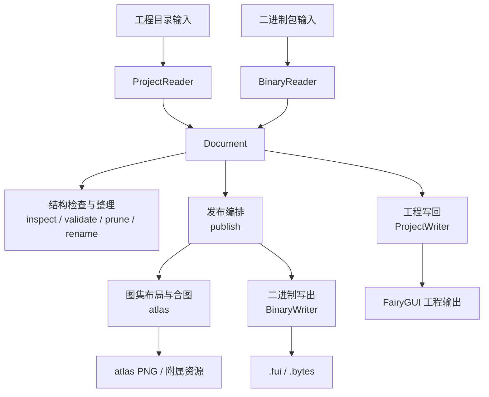

# OpenFairyGUI 架构图说明

## 结论

当前仓库更适合理解成五段式结构：`输入源 -> 协议适配 -> 领域模型 -> 工作流 -> 输出物`。  
其中真正稳定的中心层是 `Document + Property Graph`，CLI 和 publish 都只是围绕这层做编排。

## 关键细节

| 层级 | 当前职责 | 核心文件 |
|---|---|---|
| 入口层 | 命令行封装与参数分发 | `packages/cli/src/cli.ts` |
| 协议适配层 | 屏蔽平台文件系统差异，承接工程格式与二进制格式的读写 | `packages/core/src/io/platform-io.ts`、`packages/core/src/io/node-io.ts`、`packages/core/src/io/project-reader.ts`、`packages/core/src/io/binary-reader.ts` |
| 核心模型层 | `Document` 持有 `Property Graph`，统一组织项目节点、资源节点与组件语义对象 | `packages/core/src/document.ts`、`packages/core/src/properties/property.ts` |
| 项目骨架层 | `Root -> Package -> Resource -> Component` 组成基础结构 | `packages/core/src/properties/root.ts`、`packages/core/src/properties/package.ts`、`packages/core/src/properties/component.ts` |
| 工作流层 | 面向自动化的可组合处理管线 | `packages/functions/src/inspect.ts`、`packages/functions/src/validate.ts`、`packages/functions/src/prune.ts`、`packages/functions/src/rename.ts`、`packages/functions/src/publish.ts` |
| 输出层 | 工程文件写回、图集产物生成、二进制封包输出 | `packages/core/src/io/project-writer.ts`、`packages/functions/src/atlas.ts`、`packages/core/src/io/binary-writer.ts` |

补充说明：
- `@openfairygui/core` 定义文档模型与协议读写能力。
- `@openfairygui/functions` 只组合流程，不重新定义底层协议。
- `@openfairygui/cli` 是入口层，不下沉协议细节。

## 当前最关键的数据流

## 模块边界

| 模块 | 负责内容 | 不负责内容 |
|---|---|---|
| `@openfairygui/core` | 文档模型、属性节点、项目格式读写、二进制协议读写 | 发布编排、命令行参数封装 |
| `@openfairygui/functions` | inspect / validate / prune / rename / atlas / publish 等流程组合 | 协议定义、Property Graph 基础建模 |
| `@openfairygui/cli` | 命令入口、参数解析、调用装配 | 领域模型定义、协议定义 |
| `@openfairygui/test-utils` | 测试辅助与夹具支持 | 生产协议与运行时流程 |
