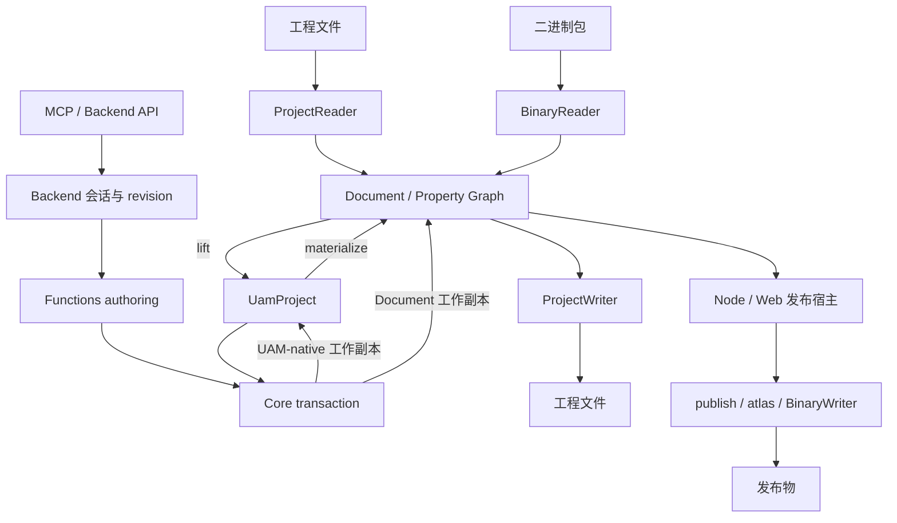

# OpenFairyGUI 架构总览

本页只说明职责、事实源、数据流与安全边界。安装、术语、参考语料和验证命令见[开发指南](./guide/development.md)，具体修改起点见[任务指引](./guide/task-recipes.md)。字段、默认值和操作目录由各自的正式文档维护，不在总览复制。

## 结论

UAM 是公开的声明式 authoring 契约；`Document + Property Graph` 是 Core 内部的物化、协议适配与执行表示。已有工程文件仍是导入时的事实来源，不能通过手工 lift 后重新导入 UAM 来绕过源文件保真检查。

Core 拥有事务语义，Functions 组合工作流，Backend 管理会话状态与保存，CLI/MCP 只做入口适配。可读取、可物化、可编辑、可保存和可发布是不同能力；查询或预演成功不授予后续写入权限，也不保证保存或发布成功。

## 模块边界与事实源

| 模块 | 拥有的职责与修改入口 | 不拥有的职责 |
|---|---|---|
| Core | `packages/core/src/uam/model.ts`、`transaction-contracts.ts`、`transaction.ts`：UAM 与事务；`properties/`：正式属性；`io/`：XML、二进制和平台 I/O | 会话、传输协议、高层发布/恢复策略 |
| Functions | `packages/functions/src/uam-transaction.ts`：结构化无状态事务结果；`validate.ts`、`publish.ts`、`restore.ts`、`atlas.ts`：工作流 | 第二套 selector / operation grammar，authoring 隐式触发发布/恢复 |
| Backend | `packages/backend/src/runtime.ts`：装配；`runtime/contracts.ts`：方法签名；`runtime/capabilities.ts`：能力；`services/`：read / authoring / artifact / runtime；`storage.ts`：存储适配 | Core 语义、MCP 传输、在 browser-safe 会话中执行发布/恢复 |
| MCP | `packages/mcp/src/tool-metadata.ts`、`tool-handler.ts`：方法映射、传输注解、宿主字段排除和预算；resources / prompts / stdio | 事务内核、路径授权、自动修复、artifact 执行权 |
| CLI | `packages/cli/src/cli.ts`、`commands/`：参数与调用装配；`contracts.ts`、`utils/json-output.ts`：进程 JSON envelope | 领域协议；工作流 result 仍复用 Core/Functions/Backend 类型 |
| test-utils | `packages/test-utils/`：测试辅助和固定提交的 fixture | 生产协议或运行时工作流 |

`scripts/generate-contracts.mjs` 用已有 TypeScript 编译器从 Core/Backend/CLI 类型生成结构 schema、操作目录、版本绑定语料及文档表格；MCP 复用现有 Zod 校验结构，Core 再校验语义。独立的 `@openfairygui/backend/docs` 分发生成数据，不引入 Backend → CLI 的运行时依赖，也不让 Core 依赖 Zod。

Backend 的带类型诊断目录覆盖正式错误码，记录共享码的全部 owners、文档 URI 和恢复建议；响应保留实际来源与原错误字段。CLI/MCP 共用随安装版本发布的离线语料与薄 Skill。精确字段、版本和摘要见[契约查询](./guide/contracts.md)、[诊断与恢复](./guide/diagnostics.md)、[安装版本文档](./guide/installed-docs.md)。

## 当前最关键的数据流

`bridge.ts` 保持 lift/materialize 门面；实现分别位于 `bridge-lift.ts`、`bridge-materialize.ts`、`bridge-shared.ts`，受控源文件枚举归 `project-source-files.ts`。二进制使用 `Uint8Array`，转换和事务工作副本保留字节，不经过 JSON clone。

工程读取、UAM 检查与源数据验证分层：`readProjectDetailed` 报告读取完整性，`validateUamProject` 检查模型，Functions 组合为正式验证报告。`invalid` 是确定错误，`incomplete` 是能力或数据不足；详见[工程验证](./project-validation.md)。

## 事务与预校验

稳定入口为 `packages/core/src/uam/transaction.ts`。`validateTransactionSupport(project)` 检查全项目支持范围；传入 operations 时按触及范围、批次顺序和最终引用检查。支持检查不是完整执行预演。

`transaction-preflight.ts` 保留逐操作分发和阶段顺序，领域实现位于 `packages/core/src/uam/preflight/`：

| 文件 | 不变量 |
|---|---|
| `support.ts`、`values.ts` | 支持范围、selector、诊断构造、共享值与安全名称校验 |
| `settings.ts` | 工程/包设置快照、JSON-safe 值及规范比较 |
| `display.ts` | 节点类型对应的属性快照与无变化判定 |
| `behaviors.ts` | controller、transition 与 gear 的页面、目标和同批绑定关系 |
| `resources.ts`、`resource-folders.ts` | 资源源字节、PNG/JPEG/JTA、目录与 atlas 约束 |
| `lifecycle.ts` | 在同一工作副本中按顺序投影分支、包、组件、资源、目录及显示列表重写 |
| `projected-state.ts` | 最终 group / 资源引用，以及未触及的既有问题边界 |

生命周期投影复用实际 UAM apply helper，不另建执行器。领域函数不能各自遍历并重排整个批次；错误码、路径、诊断顺序与失败不修改输入必须保持。`uam-transaction-support.test.ts`、`uam-transaction-apply.test.ts`、`uam-transaction-lifecycle.test.ts` 覆盖这些职责和跨域批次。

执行按现有操作能力进入 `transaction-uam-apply.ts` 或 `transaction-document-apply.ts`，失败丢弃私有工作副本，成功返回新的规范 UAM。物化支持范围不等于任意字段 mutation；原子生命周期批次也不是任意 operation 的自由组合。精确语法、支持范围与查询入口见[契约指南](./guide/contracts.md)。

## Backend 会话与保存

现有文件工程用 `openSession`：获取覆盖会话生命周期的锁、水合资源字节，并比较原 Document 与 UAM 往返后的完整 ProjectWriter 输出。未建模的写回差异标记为 `uamFidelity: unsupported`，实际写入会拒绝。只有调用方 UAM 本身就是事实来源时，才用 `openProjectSession` 与 `materializeSession` 建立新 workspace。

| 操作 | 状态与副作用 |
|---|---|
| `queryEntity` | 五类固定投影：resource、component、displayNode、controller、transition；精确 selector、实际 revision、脱离会话且有界；不含源字节 |
| `preflightTransaction` | 同一会话队列检查 revision，复制工程/字节并执行后丢弃；不改工程、dirty、revision、缓存或业务事件，不写盘 |
| `applyTransaction` | 再次检查 expectedRevision；成功替换会话工程，revision 加一并标 dirty；失败保留工程与 revision，可发出拒绝事件 |
| `saveSession` | 用会话绑定的文件系统保存；成功才更新 lastSavedRevision、清 dirty 与待清理路径；不推进编辑 revision |
| `materializeSession` | 显式目标和适配器下的完整首次写回；保留路径、保真与验证门禁，不用它绕过 dirty 保存 |
| `closeSession` | 排在此前事务/写入之后释放锁；不自动保存未提交工作 |

预演比较两份正式 UAM 得到实体/字段影响，并复用内存捕获文件系统与 ProjectWriter 得到工程相对文件/目录差异。它反映当前 revision 到预演结果，不是上次保存以来的累计差异、磁盘写入清单或删除授权。摘要超预算时完整拒绝，不截断为成功；保存提示的 `writeVerified` 始终 false，projected revision 不被预留。详见[事务预演](./guide/contracts.md#预演一次事务)。

会话队列串行化预演、提交、保存、物化和关闭。事件是有界轮询日志；job 只支持内存 `cache.refresh` 与协作取消；cache 是 revision-bound 派生数据，不是事实源。artifact plane 只声明宿主能力，不执行 publish/restore。

## Node / Web 与路径边界

- Core、Backend 根入口保持 browser-safe；平台 I/O 从 `@openfairygui/core/node` 或 `/web` 获取，仅需适配器类型时用 `/project-io`。`@openfairygui/functions/uam` 是 Backend 浏览器入口所用的窄事务工作流。
- Node 默认装配位于 `packages/backend/src/node.ts`。打开前拒绝工程树中的符号链接，每次路径操作还检查最近存在祖先的 realpath；allowed roots 由 Backend 执行，MCP roots 不授予权限。
- Node 持久锁只自动回收同主机且能确认 owner 已失效/PID 复用的有效记录；损坏、跨主机或活跃锁仍冲突。保存使用同级 staging、backup 与目录切换，失败恢复原树。
- 浏览器通过 `createBackendStorageFileSystem` 注入异步存储，提供 `unlink` 和非递归 `rmdir`。Web Locks 原子排斥活跃标签，刷新/终止由浏览器释放；无 Web Locks 时须注入等价租约。持久锁文件不是浏览器锁事实源。
- 通用浏览器适配器不自动获得 Node 的原子保存语义；未提供 `runProjectWriteTransaction` 时不声明 `atomicSave`。旧源文件与空目录仅在新的工程写入全部完成后按受控清单清理。
- 浏览器图片替换通过异步事务与公开 `@openfairygui/core/image-validation-worker` 入口进行严格验证；宿主须将 worker 及其依赖打成相邻的独立 ESM 文件。同步 browser 入口拒绝图片替换；MovieClip 使用同一 JTA 解析路径。

`@openfairygui/core/web` 只提供工程树读写，不包含二进制 I/O、会话、发布或恢复。OPFS / 用户 Folder 的存储权限由浏览器宿主处理。可运行接法及 worker 打包要求见[包入口](./guide/packages.md)与[浏览器示例](./guide/examples.md#真实浏览器存储)。

## Publish / Restore 宿主边界

`packages/functions/src/publish.ts` 编排设置、资源闭包、atlas、二进制与代码生成；选项/资源域归 `publish/`，packing 与 JTA/FNT codec 归 `atlas/`。Node/Web 复用主链，不从 Backend 会话隐式启动。

- `publishNode()` 注入 Node 文件系统、Sharp 和工程插件；显式 output 使用同级 staging 后提交，拒绝既有输出中的符号链接。返回文件清单来自本次实际写入与 atlas 完成记录，不枚举旧目录推测。
- `publishBrowser()` 注入调用方文件系统、Canvas raster adapter 和空 hooks；不支持的设置在写入前拒绝。输出原子性由宿主负责，失败清单仅包含已完成的写入。
- `restoreNode()` 只从可信本地发布目录恢复到独立工程目录，复用 `restore.ts` 与 `restore-internals/` 的路径检查、重建和输出事务。它不保证恢复原 XML、编辑器设置、未发布内容或本地状态，也不判定未知输入是否可信。

CLI 只解析参数、调用正式 Node 入口并包装结果。产品 MCP 不提供 publish/restore 执行工具；评测中的独立 artifact 宿主使用固定输入/目录的受限工具，不扩大产品权限。

## 协议与行为细节索引

| 需要确认的事实 | 正式文档 |
|---|---|
| XML 属性、结构节点与 displayList variants | [属性协议](./project-xml-attribute-reference.md)、[DisplayList 标签](./project-xml-displaylist-variants.md)；元数据实现为 `packages/core/src/io/project-xml-protocol.ts` |
| sidecar、资源/文件夹、分支目录、图片/JTA、发布设置与写回 | [编辑器发布设置](./editor-publish-settings.md) |
| 二进制 block、资源编码、附属文件命名、高分辨率与分支发布 | [二进制包协议](./fairygui-binary-package-format.md)、[发布设置](./editor-publish-settings.md) |
| 完整性、解码能力与安全失败 | [工程验证](./project-validation.md)、[诊断](./guide/diagnostics.md) |
| 发布插件与受限恢复 | [插件边界](./publish-plugins.md)、[恢复限制](./published-project-restore-limitations.md) |

## 契约与消费者验证

`agent/impact-map.json` 驱动变更测试与 AGENTS 指引表；`check:ci` 组合完整测试、契约/文档检查、文档构建和仓库外五包安装消费者。发布前检查将要发布的同一组 tarball，不用 workspace 链接替代。

消费者运行公开 Node / MCP stdio 示例，并在真实 Chromium 中执行 OPFS → Core adapter → Backend session → 预演/编辑/保存 → WebIO 水合回读；验证源字节、Web Locks、刷新恢复与路径拒绝。它不代表用户 Folder 交互授权、渲染器或所有浏览器已经验证。

十个真实消费者评测涵盖读取、精确编辑、并发恢复、保留未保存工作的安全停止及独立发布/恢复。reference 是确定性门禁，真实模型结果是手动观察，两者分别记录，不能相互冒充。任务、历史证据与限制见[Agent 评测](./guide/agent-evaluations.md)。

仓库 doctor 检查开发版本、依赖/导出、参考资料、原生 PNG/JPEG 编解码及临时目录；产品 doctor 检查安装环境、原生编解码、临时/显式输出目录，并可验证显式工程。两者都不安装、不创建会话/锁/探针、不运行插件或发布/恢复，访问检查不证明后续写入或回滚。具体覆盖见[开发验证](./guide/development.md)和[安装版本诊断](./guide/installed-docs.md)。
