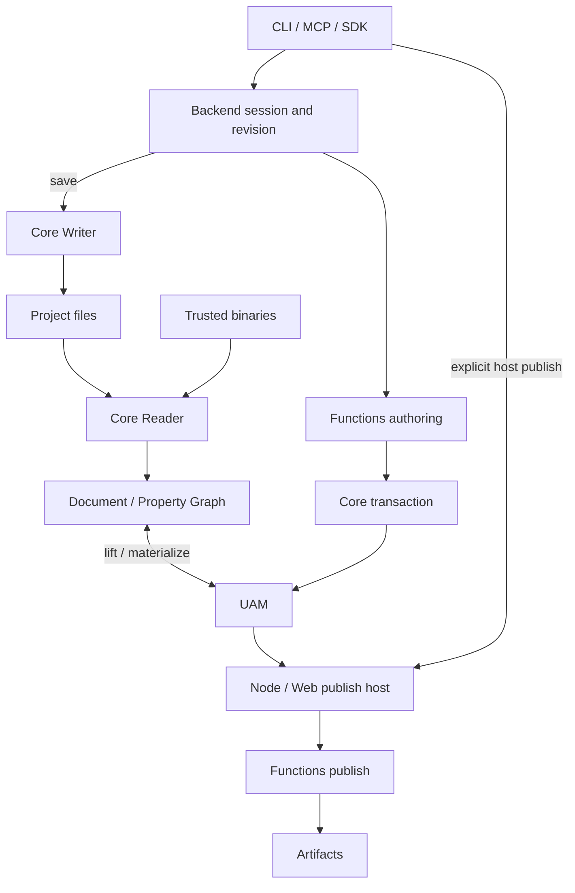

# OpenFairyGUI architecture

UAM is the public declarative authoring contract. Document / Property Graph is Core's internal materialization and protocol model. Imported files and read diagnostics determine source completeness; query, preview, save and publish are separate capabilities.

| Package | Ownership |
|---|---|
| Core | Formal properties, UAM, selectors, transaction semantics, XML/binary codecs and platform I/O |
| Functions | Stateless transaction results, validation, atlases, publishing and limited recovery |
| Backend | Sessions, locks, revision, storage coordination and read/authoring/runtime services; browser-safe root |
| CLI | Arguments, exit codes and JSON envelopes; calls Functions/Backend |
| MCP | Backend transport mapping, budgets, documentation and prompts; optional host-injected publishing |
| test-utils | Test helpers and pinned public fixtures |

Node capabilities use /node entries. Backend entries share runtime within each module format; ESM and CJS remain separate graphs without cross-format identity guarantees. Installed packages contain built entries, declarations and offline docs; CLI does not inline private dependency copies.

## Data flow

Transactions execute on private copies and commit only on success. Preflight executes and discards without reserving a revision. Backend serializes session operations; apply and save each check revision. Full model reads omit primary resource bytes, which have a separate revision-bound read API.

Reading, UAM validation and host decoding are separate layers. Invalid means definite errors; incomplete means missing data or capabilities. Save stages project-owned files, rechecks identity and rolls back failures, preserving unrelated files; cleanup failures report retained backups. Path authorization, real file identity and locking belong to Backend/host, not MCP annotations.

Functions owns Node/Web publishing. Default MCP does not publish. An injected publish callback owns authorization, output confinement and plugin policy without adding Backend methods. CLI tx opens a fresh session per invocation and previews, applies, validates, saves and closes under one lock; a separate preflight process does not preserve session revision.

## Contracts and documentation

Core/Backend/CLI TypeScript types generate operation schemas and command envelopes. Backend/docs distributes the installed corpus. MCP compiles schemas lazily and checks input budgets before deep validation. Native binary output uses base64 and appears only in structuredContent; arbitrary JSON metadata is not converted to bytes. Host policy runs after input validation and before Backend invocation.

See [contracts](./guide/contracts.md), [validation](./project-validation.md), [diagnostics](./guide/diagnostics.md), [installed docs](./guide/installed-docs.md), [publish settings](./editor-publish-settings.md), [binary format](./fairygui-binary-package-format.md) and [plugins](./publish-plugins.md). Implementation entrypoints belong in [task recipes](./guide/task-recipes.md); verification in [development](./guide/development.md); future work in the [roadmap](./guide/roadmap.md).
