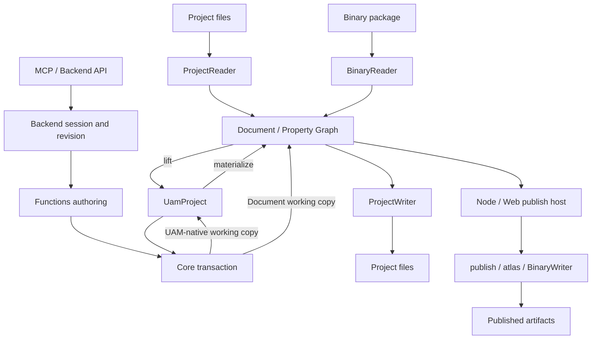

# OpenFairyGUI Architecture Overview

This page describes ownership, sources of truth, data flow and safety boundaries. See [development](./guide/development.md) for setup, terminology, references and checks, and [task recipes](./guide/task-recipes.md) for change entrypoints. Canonical documents own field lists, defaults and operation catalogs; the overview does not duplicate them.

## Summary

UAM is the public declarative authoring contract. `Document + Property Graph` is Core's internal materialization, protocol-adaptation and execution representation. Existing project files remain authoritative on import; manually lifting them and importing UAM must not bypass source-fidelity checks.

Core owns transaction semantics, Functions composes workflows, Backend manages session state and persistence, and CLI/MCP adapt entrypoints. Reading, materialization, editing, saving and publishing are separate capabilities. A successful query or preview neither authorizes subsequent writes nor guarantees save/publish success.

## Module boundaries and authority

| Module | Ownership and change entrypoints | Not owned |
|---|---|---|
| Core | `packages/core/src/uam/model.ts`, `transaction-contracts.ts`, `transaction.ts`: UAM and transactions; `properties/`: formal properties; `io/`: XML, binary and platform I/O | Sessions, transport protocols, high-level publish/restore policy |
| Functions | `packages/functions/src/uam-transaction.ts`: structured stateless transaction results; `validate.ts`, `publish.ts`, `restore.ts`, `atlas.ts`: workflows | Another selector/operation grammar, implicit publishing/restoring from authoring |
| Backend | `packages/backend/src/runtime.ts`: assembly; `runtime/contracts.ts`: method signatures; `runtime/capabilities.ts`: capabilities; `services/`: read / authoring / artifact / runtime; `storage.ts`: storage adapters | Core semantics, MCP transport, publish/restore execution in browser-safe sessions |
| MCP | `packages/mcp/src/tool-metadata.ts`, `tool-handler.ts`: method mapping, transport annotations, host-field exclusions and budgets; resources / prompts / stdio | Transaction kernel, path authorization, automatic repair, artifact execution authority |
| CLI | `packages/cli/src/cli.ts`, `commands/`: arguments and call assembly; `contracts.ts`, `utils/json-output.ts`: process JSON envelope | Domain protocols; workflow results still reuse Core/Functions/Backend types |
| test-utils | `packages/test-utils/`: test helpers and commit-pinned fixtures | Production protocols or runtime workflows |

`scripts/generate-contracts.mjs` uses the existing TypeScript compiler to generate structural schemas, operation catalogs, version-bound content and documentation tables from Core/Backend/CLI types. MCP uses existing Zod structural validation; Core then validates semantics. The independent `@openfairygui/backend/docs` entry distributes generated data without a runtime Backend → CLI dependency or Zod in Core.

The generator entry owns contract assembly and command options. `scripts/contracts/schema.mjs` owns the type program and schema inference, `transport.mjs` owns input budgets and byte paths, and `output.mjs` owns bilingual tables, installed documentation and generated-file drift checks.

Core's formal UAM retains component-instance controller overrides and absent Gear defaults. Functions loads bitmap fonts from their resource branches before publish selection and builds image dependencies; Core encodes font names, glyphs, and published IDs. Code-generation name allocation belongs to Functions; MCP does not fill protocol gaps.

Backend preview materializes a potentially invalid existing snapshot only in memory to compare file changes for repair transactions. Projected state and persistence entrypoints remain strictly validated. MCP applies an aggregate 8 MiB binary input budget only at generated contract byte paths; other JSON retains general structural limits.

Backend's typed diagnostic catalog covers formal error codes, recording every owner of shared codes, documentation URIs and recovery guidance. Responses retain the actual origin and original error fields. CLI/MCP share offline content and a thin Skill shipped with the installed version. Exact fields, versions and digests belong in [contracts](./guide/contracts.md), [diagnostics](./guide/diagnostics.md) and [installed docs](./guide/installed-docs.md).

The SDK owns MCP tool discovery and dispatch; Hosts can add tools to the same server through public `registerTool()`. `toolPolicies` run Host checks after input validation and before Backend execution. A declared Host failure stops the call; allowing it invokes Backend once with the original input. Authorization and grant consumption belong to the Host; revision, path and disk guards remain in Backend. Discovery retains bounded `$ref` schemas. Host output extensions do not alter the installed Backend contracts or documentation.

## Primary data flow

`bridge.ts` remains the lift/materialize facade, with implementations in `bridge-lift.ts`, `bridge-materialize.ts` and `bridge-shared.ts`; controlled source-file enumeration belongs to `project-source-files.ts`. Binary content uses `Uint8Array`, preserved in conversions and transaction working copies without JSON cloning.

Gear string parsing belongs to `bridge-lift.ts`; Document setter mappings for specific properties belong to `bridge-materialize.ts` and are reused by creation and transaction updates. Document imports its logger leaf directly. XML readers and writers invoke the common-state handler once using the concrete tag protocol, leaving other tag-specific fields in their branches. Reading common state precedes Gear default capture and does not widen formal property ownership.

`display-object-xml-reader.ts` keeps tag dispatch and common-state reading. Its sibling `display-object-xml-text.ts`, `display-object-xml-list.ts`, `display-object-xml-behaviors.ts` and `display-object-xml-instance.ts` own text, lists, Gear/relations and instance overlays respectively. The order is specific properties → common state → Gear → relations → property overrides → extension overlays. Shared XML shapes and property-override parsing live in `display-object-xml-shared.ts`.

Project reading, UAM checks and source validation are layered: `readProjectDetailed` reports read completeness, `validateUamProject` checks the model, and Functions composes the formal validation report. `invalid` means a definite error; `incomplete` means missing capability or data. See [project validation](../project-validation.md).

## Transactions and support preflight

The stable entry is `packages/core/src/uam/transaction.ts`. `validateTransactionSupport(project)` checks full-project support; with operations it checks the touch set, batch order and final references. Support checking is not full execution preview.

`transaction-preflight.ts` retains per-operation dispatch and phase ordering. Domain implementations live in `packages/core/src/uam/preflight/`:

| File | Invariants |
|---|---|
| `support.ts`, `values.ts` | Support scope, selectors, diagnostic construction, shared value and safe-name checks |
| `settings.ts` | Project/package settings snapshots, JSON-safe values and canonical comparison |
| `display.ts` | Node-kind-specific property snapshots and unchanged-result rejection |
| `behaviors.ts` | Controller, transition and gear pages, targets and same-batch bindings |
| `resources.ts`, `resource-folders.ts` | Source bytes, PNG/JPEG/JTA, folders and atlas constraints |
| `lifecycle.ts` | Ordered branch/package/component/resource/folder/display-list projection on one working copy |
| `projected-state.ts` | Final group/resource references and boundaries for untouched pre-existing issues |

Lifecycle projection reuses actual UAM apply helpers, not another executor. Domain functions must not independently traverse and reorder the whole batch. Preserve diagnostic codes, paths, ordering and input immutability on failure. `uam-transaction-support.test.ts`, `uam-transaction-apply.test.ts` and `uam-transaction-lifecycle.test.ts` cover these responsibilities and cross-domain batches.

Execution follows existing operation capabilities into `transaction-uam-apply.ts` or `transaction-document-apply.ts`, discarding private working copies on failure and returning new normalized UAM on success. Materialization support does not imply arbitrary field mutation, and atomic lifecycle batches are not unrestricted operation combinations. See [contracts](./guide/contracts.md) for exact grammar, scope and discovery.

`property-updates.ts` owns display-property update rules shared by preflight projections and both execution paths. The Document path lifts the target node's properties, applies the update and writes through the bridge onto the existing object, preserving Gear and Controller object bindings. Ordered preflight owns Controller payload validation; the executor resolves live references and reuses bridge Controller creation and Gear type mapping. `uam-transaction-parity.test.ts` triggers the Document path with Controller operations whose net effect is empty, then compares shared-operation results, diagnostics and input immutability.

## Backend sessions and persistence

Use `openSession` for an existing file project: it acquires a session-lifetime lock, hydrates source bytes and compares complete ProjectWriter output before and after the original Document's UAM round-trip. Unmodeled write-back differences mark `uamFidelity: unsupported`; actual writes are rejected. Use `openProjectSession` and `materializeSession` to bootstrap a new workspace only when caller-provided UAM itself is authoritative.

| Operation | State and effects |
|---|---|
| `queryEntity` | Seven fixed projections: project, package, resource, component, displayNode, controller and transition; no selector for the project, exact selectors otherwise; actual revision, detached and bounded values, no source bytes |
| `preflightTransaction` | Checks revision in the same session queue, copies project/bytes, executes and discards; no project/dirty/revision/cache/business-event changes or disk writes |
| `applyTransaction` | Rechecks expectedRevision; success replaces the project, increments revision and marks dirty; failure retains project/revision and may emit rejection events |
| `saveSession` | Saves through the session-bound filesystem; only success updates lastSavedRevision and clears dirty/pending cleanup; does not advance edit revision |
| `materializeSession` | Explicit target/adapter for complete first write; retains path, fidelity and validation gates rather than bypassing dirty saves |
| `closeSession` | Releases the lock after earlier transactions/writes; does not automatically save pending work |

Project and package settings queries reuse `ReadService` fixed projections, JSON budget checks and deep copying, returning identity and complete `settings`. Callers change requested fields and pass the complete settings with the queried revision to existing `updateProjectSettings` / `updatePackageSettings` transactions. MCP directly maps this query and transaction flow.

Preview compares two formal UAM snapshots for entity/field impacts and reuses the capture filesystem plus ProjectWriter for project-relative file/folder differences. It represents current revision → preview result, not cumulative changes since the last save, a disk-write list or deletion authority. Over-budget summaries fail completely rather than truncate into success; persistence hints always report `writeVerified: false`, and projected revision is not reserved. See [transaction previews](./guide/contracts.md#preview-a-transaction).

`SessionOperationQueue` serializes preview, apply, save, materialize and close for one session without blocking other sessions. `SessionRegistry` exclusively owns session and path indexes: opening and materializing into new storage reserve the target before asynchronous I/O, commit the binding after success, and release only their own reservation on failure. Failed rebinding retains the original binding. Host locks across runtimes and storage transactions retain their respective responsibilities.

`ReadService` receives only session views with deeply read-only UAM and detaches responses after checking their budgets. `AuthoringService` receives transaction session lookup, cache/event commands and the queue. `RuntimeService` opens and closes sessions; `PersistenceService` saves and materializes through the existing `session-project-writer.ts`. `EventService` and `CacheService` exclusively own event sequences/logs and cache entries, querying only the session fields they need.

Events are bounded polling logs. Cache entries are keyed by sessionId and contain revision-bound derived data, not source truth. `refreshCache` computes counts synchronously, emits one `cache.updated` event and directly returns `BackendCacheSnapshot`, without changing edit or saved revisions. The Backend contract version is `3.0.0` and capability schema is `12`. The artifact plane declares host capabilities without executing publish/restore.

Save and materialize share an internal PersistenceService completion step: update the saved revision, clear dirty, refresh cache, then emit `save.completed` followed by `cache.updated`. Each path retains its own validation, storage binding and error results; both remain serialized by the same session queue.

Pure in-memory session `canonicalProjectPath` / `canonicalPathKey` values identify a session only. Save and materialize use session-bound storage or an adapter explicitly provided by the host for that call; they do not automatically acquire the runtime filesystem. Preview persistence hints reflect the actual session binding.

## Node / Web and path boundaries

- Core and Backend root entries remain browser-safe. Platform I/O comes from `@openfairygui/core/node` or `/web`; use `/project-io` for adapter types alone. `@openfairygui/functions/uam` is the narrow transaction workflow used by Backend's browser entry.
- Node assembly lives in `packages/backend/src/node.ts`. Opening rejects symlinks within the project tree, and each path operation also checks the nearest existing ancestor's realpath. Backend enforces allowed roots; MCP roots do not grant authority.
- Node persistent locks automatically recover only valid same-host records whose owner is confirmed dead or whose PID was reused. Corrupt, cross-host and active locks still conflict. Saves use sibling staging, backup and directory switching, restoring the original tree on failure.
- Browsers inject async storage through `createBackendStorageFileSystem`, providing `unlink` and non-recursive `rmdir`. Web Locks atomically exclude active peer tabs and are released on refresh/termination; hosts without them must inject an equivalent lease. Persistent files are not browser lock truth.
- Generic browser adapters do not automatically inherit Node atomic saves. Without `runProjectWriteTransaction`, they do not advertise `atomicSave`. Controlled old source files and empty folders are removed only after all new project writes complete.
- Browser image replacement uses async transactions and the public `@openfairygui/core/image-validation-worker` entry for strict validation. The host must bundle the worker and its dependencies into an adjacent standalone ESM file. Synchronous browser image replacement is rejected; MovieClips use the shared JTA parser.

`@openfairygui/core/web` provides project-tree I/O only, not binary I/O, sessions, publishing or restoration. Browser hosts handle OPFS/user-folder permissions. See [package entries](./guide/packages.md) and the [browser example](./guide/examples.md#real-browser-storage) for working adapters and worker packaging.

## Publish / Restore host boundaries

`packages/functions/src/publish.ts` orchestrates settings, resource closure, atlas, binary output and code generation. Option/resource domains live in `publish/`; packing and JTA/FNT codecs live in `atlas/`. Node/Web reuse the main workflow without implicit execution from Backend sessions.

- `publishNode()` injects Node filesystem, Sharp and project plugins. Explicit output uses sibling staging before commit and rejects symlinks in existing output. Its returned file list comes from actual writes and atlas completion records, not enumeration of old output.
- `publishBrowser()` injects caller filesystems, a Canvas raster adapter and empty hooks, rejecting unsupported settings before writing. Output atomicity belongs to the host; failure lists contain only completed writes.
- `restoreNode()` restores only trusted local published directories into separate project directories, reusing path checks, reconstruction and output transactions in `restore.ts` and `restore-internals/`. It does not guarantee original XML, editor settings, unpublished content or local state, and does not decide whether unknown inputs are trustworthy.

`restore.ts` keeps preparation, writing and commit order. `restore-internals/resource-paths.ts` owns controlled source lookup and output paths, reusing resource-path validation from `path-utils.ts`. `skeleton.ts` owns skeleton type repair, sidecars and dependency links; `asset-output.ts` owns atlas cropping, generated files and loose-file output. Font and MovieClip reconstruction reuse `font.ts` and `movie-clip.ts`, with concrete Core resource types.

Core owns image serialization hints through `ProjectWriter.setImageWriteHints(image, { omitPackageSize: true })`. Hints follow image object identity without entering properties or `extras`. Restore marks inferred dimensions; a new Writer still honors the hints on the returned `Document`, and empty hints restore normal writing. Hints do not propagate across UAM conversion, reloading or resource object replacement.

CLI only parses arguments, invokes formal Node entrypoints and wraps results. Product MCP exposes no publish/restore execution tools. Evaluation-only artifact hosts use constrained tools with fixed inputs/directories without widening product permissions.

## Protocol and behavior references

| Fact to verify | Canonical documentation |
|---|---|
| XML attributes, structural nodes and displayList variants | [Attribute protocol](./project-xml-attribute-reference.md), [DisplayList tags](./project-xml-displaylist-variants.md); metadata lives in `packages/core/src/io/project-xml-protocol.ts` |
| Sidecars, resources/folders, branch directories, images/JTA, publish settings and write-back | [Editor publish settings](./editor-publish-settings.md) |
| Binary blocks, resource encoding, auxiliary naming, high-resolution and branch publishing | [Binary package protocol](./fairygui-binary-package-format.md), [publish settings](./editor-publish-settings.md) |
| Completeness, decoding capabilities and safe failure | [Project validation](../project-validation.md), [diagnostics](./guide/diagnostics.md) |
| Publish plugins and limited restoration | [Plugin boundaries](./publish-plugins.md), [restore limits](./published-project-restore-limitations.md) |

## Contracts and consumer verification

`agent/impact-map.json` drives test selection and the AGENTS guidance table. `check:ci` combines full tests, contract/documentation checks, documentation builds and external five-package installed consumers. Release checks the exact tarballs about to be published, not workspace links.

`scripts/consumer/helpers.mjs` owns shared consumer checks for file containment, public exports, bins, CLI envelopes and directory snapshots. Acceptance scenarios and repository self-tests depend directly on this leaf. Both the isolated-consumer copy inventory and Agent evaluation harness digest include it; shared helpers are not imported from the runtime scenario entry.

Consumers run public Node/MCP stdio examples and real Chromium OPFS → Core adapter → Backend session → preview/edit/save → hydrated WebIO reread. Checks cover source bytes, Web Locks, refresh recovery and path rejection, not interactive user-folder authorization, renderers or every browser.

Ten real consumer evaluations cover inspection, precise edits, concurrent recovery, safe stopping with pending work preserved and separate publish/restore tasks. Reference runs are deterministic gates; real-model runs are manual observations, recorded separately and never interchangeable. See [agent evaluations](./guide/agent-evaluations.md) for tasks, historical evidence and limits.

Repository doctor checks development versions, dependencies/exports, references, native PNG/JPEG codecs and the temporary directory. Product doctor checks the installed environment, native codecs, temporary/explicit output directories and optionally an explicit project. Neither installs, creates sessions/locks/probes, or runs plugins/publish/restore. Access checks do not prove later writes or rollback. See [development verification](./guide/development.md) and [installed-version diagnostics](./guide/installed-docs.md).
