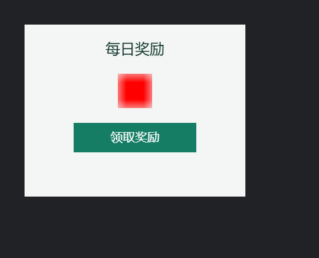
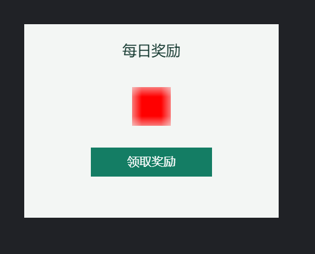
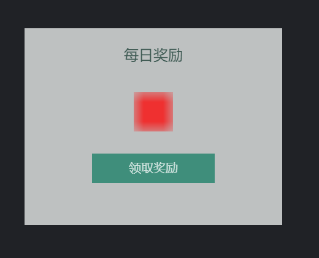
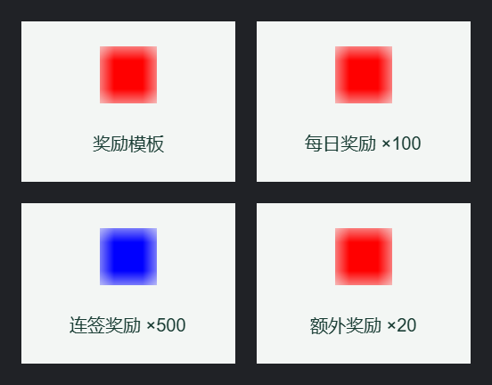

# Runnable examples and consumer verification

The seven Node examples and one browser-storage example use installed public packages, not source aliases or test utilities. Copy the repository's `examples/` directory outside the checkout and run inside that copy:

```bash
npm install
node node-inspect-validate/index.mjs
node revision-checked-edit-save/index.mjs
node publish-restore/index.mjs
node mcp-stdio-client/index.mjs
node reward-panel-states/index.mjs
node reward-panel-layout/index.mjs
node reward-card-generation/index.mjs
```

Without arguments, each command creates a separate temporary project and prints `projectPath` in its JSON output. Files remain available for inspection. The first two accept a `.fairy` path; the second modifies it and expects `Main/MainView/title`, so use a copy. The third and fifth through seventh commands create only their own examples and accept no user-directory override. Use `pack:check` below for unpublished branch changes; registry packages do not represent the current checkout.

## Three-state reward panel

This is the complete SDK implementation of the [first editing task](./getting-started.md#complete-your-first-edit), runnable on stable `0.5.0`. After creating a temporary two-package project, it obtains unique IDs for `Main/RewardPanel`, `claimButton`, and `claimedMark` from the outline. One transaction adds a `rewardState` controller and three gears (`text`, `look`, and `display`) for Locked, Claimable, and Claimed states. Existing layout, other components, and Shared package images are preserved.

To let an agent perform the task, create only the unedited project:

```bash
node reward-panel-states/index.mjs --create
```

Running `node reward-panel-states/index.mjs` (or `npm run reward`) creates another independent project and completes the SDK edit, validation, save, and UAM reread. Both commands print the actual `projectPath`; the no-argument command does not continue editing a project from a previous `--create` run.

<<< ../../../examples/reward-panel-states/index.mjs#example {js}

Import `editRewardPanel(projectPath, runtime?)` to drive the same workflow from a host. Validation, save, or reread failures after apply keep the session open and throw `recovery: { runtime, sessionId, projectPath }`, preserving the failure report in `cause`. Follow the recovery rules in the single-field example below. Repeating the same task is rejected because the controller already exists; the host should query and replan.

Consumer checks execute this editing function against both the SDK and real MCP stdio. Preview leaves files untouched. An independent full-UAM comparison after saving allows only the specified controller and three gears to be added. The complete file list is unchanged; only `assets/Main/RewardPanel.xml` bytes change, preserving all other files, including PNGs. Reopening can query the controller, and repeating the task is rejected without changing files. These checks do not render FairyGUI or exercise clicks. Follow the [three-state table and workflow](./getting-started.md#complete-your-first-edit) for visual acceptance in an editor or runtime.

## Reward panel layout and entrance animation

Advanced task B starts from A's saved three-state panel, adjusts spacing, dimensions, and positions, and adds a one-shot entrance animation. Stable `0.5.0` supports it. Controllers, gears, text, and image bytes remain unchanged.

To let an agent perform B, create a project with A completed and the original layout intact:

```bash
node reward-panel-layout/index.mjs --create
```

Follow the [setup guide](./getting-started.md#complete-your-first-edit) to authorize the parent directory of the output `projectPath` and restart the MCP connection. Then give the agent this task:

> Resize `Main/RewardPanel` at `<projectPath>` to 420 × 320 and update its five child nodes using the table below. Add an `intro` transition at 30 fps: start two 12-frame QuadOut tweens at frame 0, fading the panel itself from alpha 0 to 1 and moving it from offset (0, 24) to (0, 0). Autoplay once on entry without delay. Preserve the three-page `rewardState` controller, all gears, text, other components, and resource bytes. Query exact IDs and the current revision, then preview, apply, validate, save, and reopen one batch of seven operations. Stop and report ambiguous targets, a missing A controller, an existing `intro`, revision conflicts, or incomplete validation, preserving applied but unsaved work.

| Node | Original → new position | Original → new size |
|---|---|---|
| `background` | (0, 0) → (0, 0) | 360 × 280 → 420 × 320 |
| `title` | (24, 24) → (32, 28) | 312 × 32 → 356 × 36 |
| `rewardIcon` | (152, 80) → (178, 104) | 56 × 56 → 64 × 64 |
| `claimButton` | (80, 160) → (110, 204) | 200 × 48, unchanged |
| `claimedMark` | (24, 228) → (32, 272) | 312 × 28 → 356 × 28 |

The seven operations are one `setComponentProps`, five `setDisplayNodeProps`, and one `addTransition`. UAM transition times and durations use frames: 12 / 30 = 0.4 seconds. Both items have an empty `targetNodeId`, targeting the panel itself; movement is relative to its host position. The animation does not deliver rewards or change controller pages.

<<< ../../../examples/reward-panel-layout/index.mjs#example {js}

Import `redesignRewardPanel(projectPath, runtime?)` from a host; failures after apply use the same recovery handle and rules as A. Running `node reward-panel-layout/index.mjs` (or `npm run reward-layout`) creates another independent project, completes B, and publishes the before/after `.fui` files and atlases separately. JSON fields `before.files` / `after.files` list actual paths. Both output directories are outside the project directory. This does not overwrite user projects or continue a previous `--create` result.

### Render and animation acceptance

In an existing FairyGUI/LayaAir host, load the packages from each output directory separately and create `Main/RewardPanel`. Set its host position before adding it to the stage. The redesigned panel autoplays `intro` once; replay with `panel.getTransition('intro').play()`. An editor can open `projectPath` directly to inspect the project and timeline.

These actual published-artifact screenshots use the same 520 × 420 viewport and `Claimable` page, with OpenFairyGUI `0.4.0`, LayaAir `3.3.10` / FairyGUI, and Chromium `151.0.7922.34`:

| Before | After | Animation midpoint (0.2 seconds) |
|---|---|---|
|  |  |  |

| Animation time | Panel alpha | Offset from the host position |
|---|---|---|
| 0 seconds | 0 | (0, 24) |
| 0.2 seconds | 0.75 | (0, 6) |
| 0.4 seconds | 1 | (0, 0) |

This native-runtime acceptance run checked autoplay completion, these time samples, all three A pages, and real mouse clicks responding only on `Claimable`, with no console errors. Repeat these visual checks when changing the project, styles, or runtime.

B's `pack:check` coverage includes SDK and real MCP queries, previews, save/reread, full UAM/file comparisons, rejection of a repeated task, and published binary dimensions and 0.4-second animation timing. B changes only `assets/Main/RewardPanel.xml`, preserving other file bytes. The FairyGUI screenshot verification above ran separately. The consumer gate's Chromium tests still exercise the OPFS storage page below, not this FairyGUI rendering scenario.

## Generate reward cards from a template

Task C generates three exported components from an existing `Main/RewardCardTemplate`, using stable `0.5.0`. Each new component contains one Label instance referencing the template, with formal instance properties for title and icon. The template's children remain in the original component. Icons reference the Shared package's existing 2 × 2 red and blue PNG test swatches.

Create an independent project containing the template and images, without generated cards (A/B are not prerequisites):

```bash
node reward-card-generation/index.mjs --create
```

Authorize the actual `projectPath` using the [setup guide](./getting-started.md#complete-your-first-edit), then give the agent this task and configuration table:

> Add the three exported components below to the Main package in `<projectPath>`. Query unique IDs for `RewardCardTemplate` and the Shared images. Check that the template is a Label containing a `title` text child and an `icon` Loader, and that the images are already exported. Each new component must match the template size (240 × 180 in this example) and contain only one component instance named `card`, at (0, 0) with the same size, referencing the original template and setting Label title/icon properties. Build icon URLs from actual package and resource IDs. Preserve existing resources without copying template children or images. Require all queries to share one revision. Preview and apply three `addComponent` operations in one batch, then require complete validation, save, and reopen to verify. Stop and report ambiguous targets, occupied IDs/names, revision conflicts, or incomplete validation; retain applied but unsaved work.

| New component | Stable resource ID | Title | Existing image |
|---|---|---|---|
| `DailyRewardCard` | `cardday1` | 每日奖励 ×100 | `Shared/red` |
| `WeeklyRewardCard` | `cardweek` | 连签奖励 ×500 | `Shared/blue` |
| `BonusRewardCard` | `cardbon1` | 额外奖励 ×20 | `Shared/red` |

<<< ../../../examples/reward-card-generation/index.mjs#example {js}

Hosts can import `generateRewardCards(projectPath, runtime?)`; recovery after apply follows A. Running `node reward-card-generation/index.mjs` (or `npm run reward-cards`) without arguments creates another project, generates, validates, saves, rereads, and publishes it. JSON `generated` lists new component IDs/names; `published.files` lists `.fui` and atlas paths. Publishing is outside the project directory. This command does not continue a previous `--create` result.

### Generated structure and rendering acceptance

Consumer checks run generation through the SDK and real MCP stdio: preview writes nothing; only three component XML files are added and `assets/Main/package.xml` is updated. After independently rereading and removing the three new components, the complete UAM must equal the original. Every existing file except Main's resource manifest remains byte-identical, including the template XML, other components, and PNGs. Separate checks cover generated structure, titles, icons, template references, queries after reopening, duplicate rejection, and references/instance properties in published binaries.

Load the published Shared/Main packages in a real FairyGUI/LayaAir host and create the template and three new components. This screenshot uses OpenFairyGUI `0.4.0`, LayaAir `3.3.10` / FairyGUI, and Chromium `151.0.7922.34`. Reading left to right, top to bottom: template, daily reward, weekly reward, bonus reward.



This runtime acceptance checked all four objects' text, dimensions, template URLs, and red/blue RGBA pixels at icon centers. Changing the daily card's instance text left the other cards and template unchanged; the console had no errors. Instances retain the template reference, so later template style changes affect them all. Wrapper dimensions are captured at generation time and do not automatically follow later template resizing. The example contains no reward fulfillment logic.

Screenshot acceptance runs separately from `pack:check`; it is not an automated browser rendering gate. Repeat it after changing the template, assets, or runtime. UAM, XML, binary, or `dirty: false` checks cannot replace actual rendering.

## Read and validate

The example returns the existing `InspectReport` and project validation report. Exit codes are 0 for `valid`, 1 for `invalid`, and 3 for `incomplete`. This code is included directly from the source executed by the consumer check:

<<< ../../../examples/node-inspect-validate/index.mjs {js}

The corresponding CLI commands are `ofgui inspect <project-path> --json` and `ofgui validate <project-path> --json`. Original reports are in the shared envelope's `result`; JSON read failures use the same envelope, without human logs on stdout. See [CLI machine output](./contracts.md#cli-machine-output) for shapes, exits and offline schemas. Human mode retains its terminal report.

## Revision-checked edit, save and reread

The example obtains IDs from the outline, then reads current properties and the revision with queryEntity. It previews and applies the same text edit, requires validation to be `valid` and `complete: true`, saves using the transaction's returned revision, rereads through public Node I/O, and releases the session lock. Preview reserves no revision. Errors or incomplete validation stop execution; stale writes are not blindly retried.

Validation, save or reread failures after apply keep the session open and throw an error with `recovery: { runtime, sessionId, projectPath }`; the `cause` chain preserves the original error and Backend/validation report. A host importing `editAndSave` must catch that error, resolve the fault, validate and explicitly save the same session, then close it. The optional third argument accepts a host-owned runtime. Failures before apply close the clean session. Recovery handles live only in the current process; the standalone command does not persist in-memory edits after exiting on failure.

<<< ../../../examples/revision-checked-edit-save/index.mjs {js}

## Publish, consume artifacts and perform limited recovery

The third example creates two packages containing text, components, two images and cross-package references. It publishes through `publishNode`, reads binaries from the actual returned manifest, restores those self-produced trusted artifacts into a separate directory, rereads and requires complete validation. It compares package/resource IDs, component geometry/text and references, not original project identity, editor-local state or XML spelling.

<<< ../../../examples/publish-restore/index.mjs {js}

`ofgui publish <project> -o <release-directory> --project-type layabox --json` returns `{schemaVersion:1,command:"publish",success:true,result:{files:[{path,size}]}}`. The Node workflow records actual writes with final absolute paths and byte sizes, excluding untouched pre-existing files and arbitrary private plugin I/O. Explicit runtime output is staged atomically; separate codegen destinations and plugin side effects are outside that directory transaction.

`ofgui restore <trusted-release-directory> -o <separate-project-directory> --json` returns `{schemaVersion:1,command:"restore",success:true,result:{projectPath,packages:[{id,name}],warnings}}`. Both commands exit 0 on workflow success, 1 on workflow failure and 2 on syntax errors. Failure JSON contains `success:false` and `error:{code,message}`, with `publish_failed`, `restore_failed` or `invalid_arguments`. Human logs go to stderr; stdout contains one JSON result. Help remains text. Restoration success/warnings do not replace reread validation.

Restoration accepts trusted local artifacts only, requires a separate directory and refuses overwrite by default. Even `--force` replaces the old target only after staging succeeds. See [recovery limits](../published-project-restore-limitations.md); the installed canonical boundary is available offline through `ofgui docs cat restore-limits --json`. Source information absent from published artifacts is not recoverable.

## MCP stdio client

The fourth command uses the official MCP SDK and installed `@openfairygui/mcp/stdio` export, without global executables, shell interpolation or an assumed HTTP port. It discovers tools and version-bound documentation, explicitly restricts `OPENFAIRYGUI_ALLOWED_PROJECT_ROOTS`, obtains exact `Main/MainView/title` IDs from the outline, reads the current revision and previews a text edit. It does not apply/save, asserts unchanged query results and clean session state, and closes both session and stdio transport in finally.

It accepts an optional `.fairy` file with that structure, or creates a separate demo without arguments. Opening a file session still briefly holds a lock and never bypasses another owner. `pack:check` executes this file directly, verifies all project files stay unchanged, and proves lock release by opening a subsequent session. The SDK is an explicitly declared consumer dependency, not a new product abstraction.

<<< ../../../examples/mcp-stdio-client/index.mjs#example {js}

## Real browser storage

Run `npm run browser` in the copied `examples/` directory and open the displayed localhost URL in Chromium. The example seeds only a missing `openfairygui-example/` in this origin's OPFS, never requesting local-folder permission or overwriting an existing example. Clearing site data removes it. Use Open → Preview & apply → Save → refresh → Open to see persisted title, revision and dirty state. Close refuses to discard dirty edits, but refresh can still lose in-memory changes. Validate saved files explicitly hydrates source bytes and calls `validateProjectWeb`; unloaded images cannot count as complete validation.

<<< ../../../examples/browser-project-storage/main.mjs#example {js}

The example reuses Core's File System Access adapter, `WebIO`, Backend's storage bridge and native Web Locks. `pack:check` executes this page in real Chromium: preview/failure leaves files untouched, stale revisions fail, path denial preserves dirty state, save changes only target XML, PNG bytes and red/blue RGBA stay intact, reload reads persisted edits, and two tabs prove lock contention plus release on normal close and abrupt termination. Successful evidence includes `browser-evidence.json` and `browser-consumer.png`; failures preserve the consumer directory.

OPFS is origin-private storage, not a user directory selected by `showDirectoryPicker`. This does not validate local-folder permission, IndexedDB/ZIP adapters, a cross-browser matrix, image-replacement Workers or FairyGUI rendering. See [MDN OPFS](https://developer.mozilla.org/en-US/docs/Web/API/File_System_API/Origin_private_file_system).

## Verify the checkout or release artifacts

From the repository root:

```bash
pnpm pack:check
pnpm pack:check --artifacts .release
```

The first command builds and packs the five current publishable packages. The second reads the five tarballs matching current package names and versions from the supplied directory without repacking. Release runs this second form before either registry publish, checking the exact files to be published.

Checks run in a fresh directory outside the checkout:

- Install production dependencies from the five local tarballs, overriding internal package resolutions to those same files; disallow workspace links and clear ambient Node loader/source-resolution settings.
- Inspect actual `exports`, packed files, ESM imports, CJS requires, and Node/Web entrypoints. The Worker is a separate browser entry, not imported in the Node main thread.
- Verify installed CLI/bin mappings, versions, inspect/validate JSON, and MCP stdio initialization and tool discovery.
- Execute all seven Node examples, including the real stdio client, and assert read-only inspection/preview, the requested semantic edits and corresponding XML changes only, no unrelated new files, released session locks, and rejected stale revisions. Tasks A/B/C additionally run the SDK/MCP full-model, file, published-animation, and generated-reference comparisons above. Failed validation or staged writes in the single-field editing example must preserve the revision, dirty state, diagnostics, lock and original files; explicit recovery saves and rereads the same session after the fault is resolved.
- Additionally check the actual manifest/file sizes, binary components and cross-package references, red/blue atlas RGBA pixels, recovered assets and project validation. Failed forced recovery with a corrupt atlas must preserve the entire previous target. Real artifact tasks use a separate restricted host; see [agent evaluations](./agent-evaluations.md).
- Only after production execution passes, install pinned TypeScript, Node types, esbuild and Playwright. Compile strict `.mts`/`.cts` consumers without `skipLibCheck` or source aliases, bundle browser/Worker exports without Node externals, then execute the real Chromium page checks above.

Successful checks remove only their own temporary directory. Failures preserve it and print the path; `pnpm pack:check --keep` preserves successful runs too. Registry and matching Chromium downloads require network access or caches; download/launch failures never count as passing. Playwright pins its browser version; see [browser installation](https://playwright.dev/docs/browsers). System dependencies are not installed by default. Linux CI explicitly passes `--browser-deps` to install required system packages, potentially using sudo; Windows ignores that system-dependency option. The external browser cache survives consumer cleanup.

This proves package entrypoints, types, Node workflows and the real Chromium storage page, not local-folder permissions, a complete editor UI, every image format or all publish/restore formats. Project tests and user examples remain separate; all eight examples here run in consumer verification.

See the [development guide](./development.md) for verification and CI scope, and [Packages and Tools](./packages.md) for product entrypoints.
